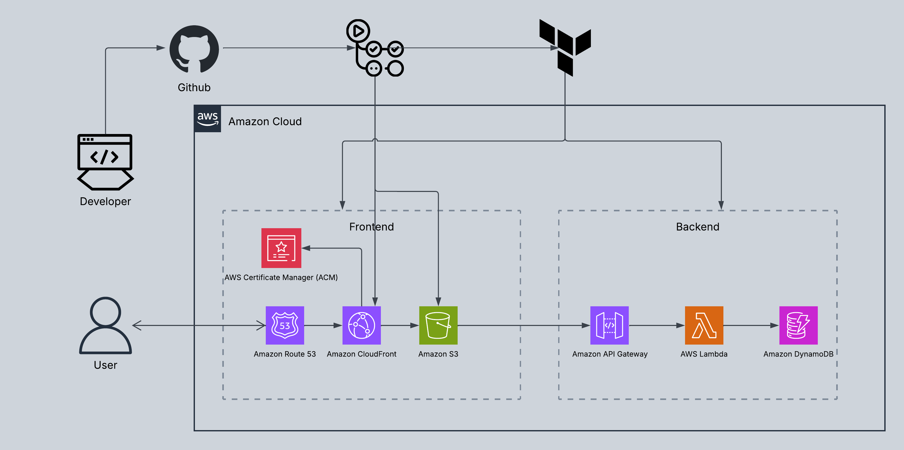

## ☁️ Cloud Resume Challenge - Saiful Rub

A production-style AWS cloud project built to demonstrate real-world DevOps, cloud architecture, and serverless engineering skills.

[Live Site](https://khansaiful.com) • [LinkedIn](https://www.linkedin.com/in/saiful-khan-29810426b/) • [Challenge](https://cloudresumechallenge.dev/docs/the-challenge/aws/)

> This repository contains the source code, architecture notes, and deployment journey for my implementation of the AWS Cloud Resume Challenge.

---

## Overview

The goal of this project is to design, secure, and deploy a personal website on AWS while documenting each phase of the build. It combines static web hosting, serverless APIs, automation, and cloud best practices into a modern resume project that reflects real production workflows.

### Included in this project

- Static website hosted on AWS
- Secure HTTPS delivery through CloudFront
- Serverless visitor counter with API integration
- CI/CD automation for continuous deployment
- Infrastructure managed with code-first principles
- Cloud architecture documentation and operational practices

---

## Architecture



### Core AWS services used

- Amazon S3 — Static website hosting
- Amazon CloudFront — Global content delivery and HTTPS
- AWS Certificate Manager — TLS certificate management
- Amazon Route 53 — DNS configuration
- AWS Lambda — Serverless backend logic
- Amazon DynamoDB — Visitor counter storage
- Amazon API Gateway — HTTP API layer
- GitHub — Source control and CI/CD automation

---

## Build phases

This project is documented through a phased implementation, with each step reflecting a key cloud engineering milestone.

### Phase 1 — Development Environment
- Set up a structured local development workflow
- Organized project files and version control
- Established a clean Git-based delivery process

### Phase 2 — Static Website Hosting
- Built the personal resume website
- Deployed the site to Amazon S3
- Configured secure bucket access policies

### Phase 3 — Domain and DNS
- Registered and configured custom domain routing
- Integrated Amazon Route 53 with the site
- Connected DNS records to CloudFront

### Phase 4 — HTTPS and Security
- Enabled CloudFront distribution
- Secured the site with ACM certificates
- Configured Origin Access Control (OAC)

### Phase 5 — CI/CD Automation
- Connected the GitHub repository to deployment workflows
- Set up automated publishing for updates
- Improved delivery speed and consistency

### Phase 6 — Cost Monitoring
- Implemented AWS Budgets
- Added cost anomaly awareness and alerts
- Applied basic FinOps practices

### Phase 7 — Serverless Visitor Counter
- Implemented tracking with:
  - AWS Lambda (Python)
  - Amazon DynamoDB
  - Amazon API Gateway
- Integrated frontend JavaScript to display the live count

### Phase 8 — Infrastructure as Code
- Migrating infrastructure to Terraform
- Aim: manage AWS resources consistently with IaC best practices

### Phase 9 — Serverless Contact Form
- Dedicated API repo: [cloud-resume-api](https://github.com/Saifulrubkhan/cloud-resume-api)
- API Gateway HTTP API + Lambda + DynamoDB (optional SES)
- Footer form wired through `src/js/contact-form.js`

---

## Local development

```bash
npm install
npm run dev      # http://localhost:5173/src/pages/index.html
npm run build    # production files → dist/
npm run preview  # serve dist/
```

**Deploy `dist/` to S3** (not the repo root). Update CodePipeline / sync steps to:

1. `npm ci`
2. `npm run build`
3. `aws s3 sync dist/ s3://YOUR_BUCKET --delete`
4. CloudFront invalidation

Shared header, nav, and footer live in `src/partials/`. Page content lives in `src/pages/`. Styles: prefer `src/styles/_custom.scss` / `_nav.scss`; base template CSS is `src/styles/site.css`.

---

## Deployment workflow

```text
Developer updates website code
    ↓
Push to GitHub repository
    ↓
CI/CD: npm ci && npm run build
    ↓
Sync dist/ to Amazon S3
    ↓
CloudFront cache refreshes
    ↓
Updated website is served globally
```

---

## Branching strategy

```text
main          → production-ready website code
Project/blog  → blog content and project notes
feature/*     → active feature development
```

This approach keeps the workflow simple, scalable, and aligned with common team practices.

---

## Project repositories

- Frontend Website: [Saiful_CloudResumeWebsite](https://github.com/Saifulrubkhan/Saiful_CloudResumeWebsite)
- Visitor Counter Backend: [Cloud-Resume-Backend](https://github.com/Saifulrubkhan/Cloud-Resume-Backend)
- Contact Form API: [cloud-resume-api](https://github.com/Saifulrubkhan/cloud-resume-api)

---

## Why this project matters

This project demonstrates hands-on experience in:

- Cloud architecture design
- Secure web delivery on AWS
- Serverless application development
- API integration and data flow
- DevOps workflows and automation
- Infrastructure as Code concepts

It strengthens my background in DevOps and supports my transition into cloud engineering and cloud architecture roles.

---

## About me

### Saiful Rub
Senior Site Reliability Engineer | AWS | Generative AI | System Design

Location: Toronto, Canada

### Certifications
- AWS Certified Solutions Architect – Associate
- AWS Certified AI Practitioner
- KCNA
- CCNA

### Currently studying
- CKA

### Connect
- [LinkedIn](https://www.linkedin.com/in/saiful-khan-29810426b/)
- [Website](https://khansaiful.com)
